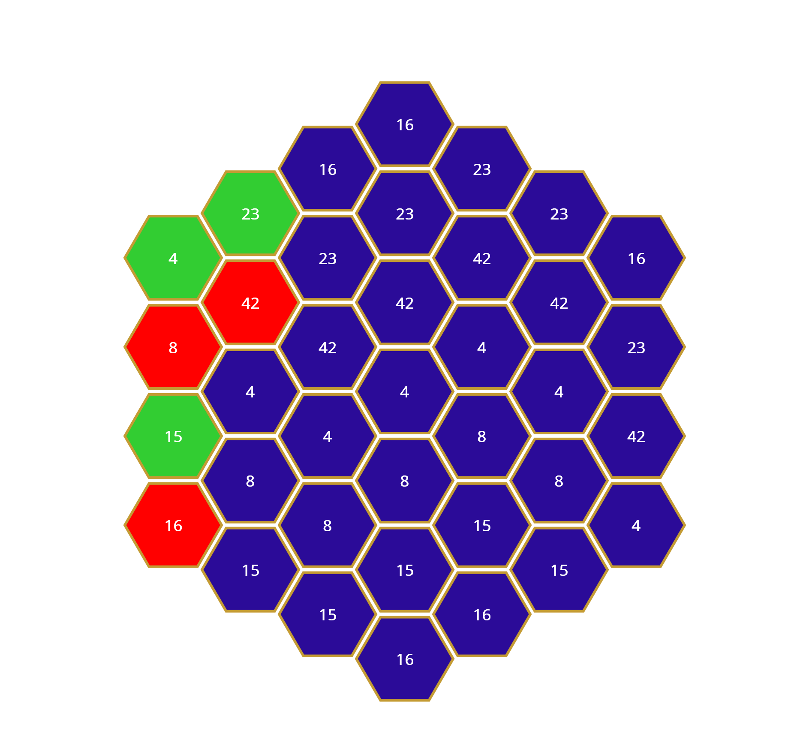

# Hexamaui

## Recommended Development Environment
* VS 2022 or greater
* .NET MAUI installed
* .NET 8.0 installed

[Follow this to set up your environment.](https://dotnet.microsoft.com/en-us/learn/maui/first-app-tutorial/intro)

## Description
This repo intends to allow .NET MAUI developers use Hexagonal UI's with ease. This repo is currently a work in progress and there are many unfinished/unconsidered UI components. 

## Projects
### Hexamaui
Core infrastructure, mathematical operations for the Hexagons are found here.
### [Considering] HexamauiUI 
Once I finish messing around in HexamauiAppSamples, I hope to add a new project just for default hexagonal grid configurations/hexagons/ui components so that minimal code is required from the user's side. 
### HexamauiAppSamples
This project provides samples for users to test and learn how to use the Hexagon UI.
What the sample project looks like as of 2/1/2024:

### HexamauiTests
Test folder for Hexamaui. 
